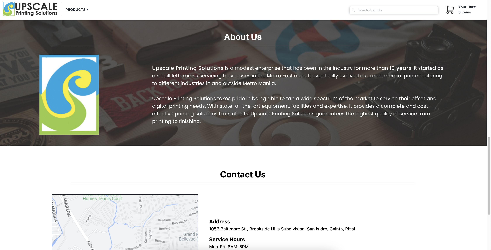
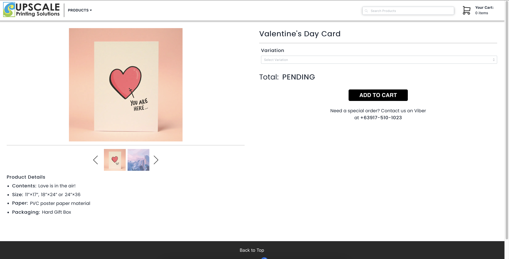

# Upscale Printing Solutions Website
Proposed website for Upscale Printing Solutions built using React, NextJS, TailwindCSS, and Firebase.

I was one of the three developers in a team of eight practicing Agile Software Development.

This is also a requirements for the course, Software Engineering (CSSWENG).

# Setting Up the Project

### Insalling Dependencies

Clone the repository, then run:

```bash
npm install --dev
```

### Start the Web App

View the project before deployment.

```bash
npm start
```

### Run Jest Test Runner

Runs unit tests specified in `./__tests__`.

```bash
npm test
```
# Project Overview
For a full experience it is best to visit our deployed website at [Upscale Printing Solutions.](https://upscale-printing-solutions.vercel.app)

## Tech Stack
### Frontend

- [React](https://reactjs.org/docs/getting-started.html)
- [Tailwind CSS Documentation](https://tailwindcss.com/docs/installation)
- [Next.js Documentation](https://nextjs.org/docs) - learn about Next.js features and API.
- [Learn Next.js](https://nextjs.org/learn) - an interactive Next.js tutorial.
- [Mantine](https://mantine.dev/pages/getting-started/) - a React component library.

### Backend

- [Firebase](https://firebase.google.com/docs/)

### Testing

- [Jest](https://jestjs.io/docs/getting-started)

## Screenshots



